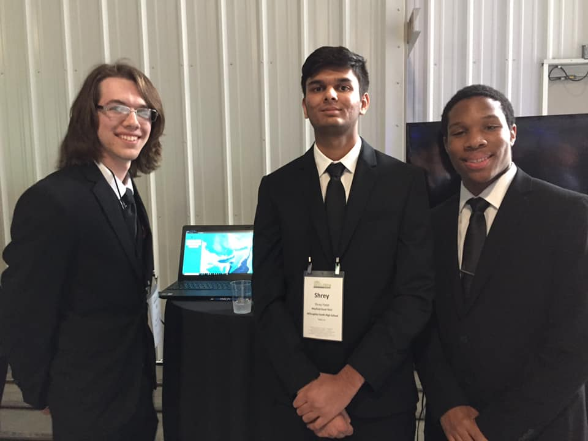

<h1>CSE-Analytics CoolTech challenge project</h1>

## Running locally
    * Make sure port 80 is not binded when running if it is change the port.
    * Fulfill the dependancies: There's a script, view the UpdatedScript folder within the repository.
    * If you're running locally on Windows you need to install the dependancies same as Linux. The demo was was run on AWS'S image(Amazon's Linux).The local demo was run using Ubuntu/CentOS. There may be a windows script release; currently there's only one for Linux. (The process is similar the only difference is some syntax and potential port issues).
    * If you're going to launch the website on Linux there's a script available to auto install python 3.6 and the dependencies.
    * A local MongoDB instance is required unless you have one in the cloud or already running on another server. MongoDB has been tested on Linux and Windows it's cross compatible. 
    * The main file is test3.py. To launch the website type "sudo python3 test.py"

## The Project
    * Create a cyber security dashboard to help businesses help thwart cyber security threats.

## Outcome
    * CSE analytics won the 11th Cooltech Challenge!

## Technologies used
    * MySQL
    * MongoDB
    * Linux
    * Python
        * Flask
        * Google drive API
        * VirusTotal API
    * HTML & CSS
    * JavaScript
        * Local extension to route downloads
        * Socket.io 
    * Teamwork
## Images of the project

## The team

